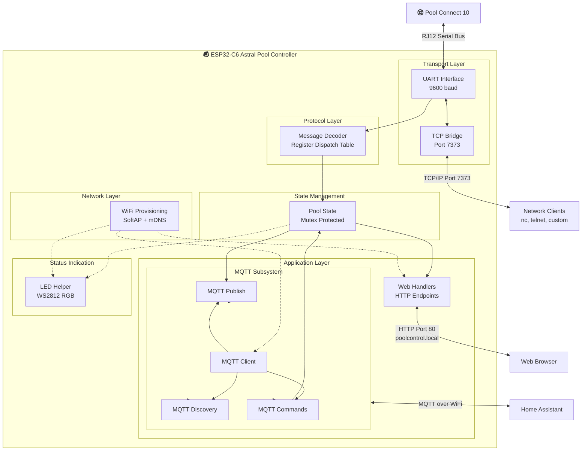

# Astral Pool Controller

Code to listen on and control an Astral Connect 10 pool controller.

This has been created by listening to the communications on the control bus, and decoding the instructions by trial and error.

## Output
To see the output, either monitor the device using the ESP monitor - or connect to the port exposed on the wifi network.

The device is accessible via mDNS at `poolcontrol.local` or by its IP address.

Example on a mac using nc (netcat)
```
% nc poolcontrol.local 7373
Connected to ESP32-C6 pool bus bridge.
UART bytes will be shown here in hex.
Bytes you send will be forwarded to the bus.

00
02 00 50 FF FF 80 00 FD 0F DC 19 0E 01 28 03
00
```

## Testing Message Decoding

You can test individual messages against the decoder using the HTTP API endpoint:

```bash
curl -X POST http://poolcontrol.local/api/test_decode \
  -d "02 00 50 FF FF 80 00 38 0F 17 D0 01 02 1A 03"
```

**Response:**
```json
{
  "success": true,
  "decoded": true,
  "length": 15,
  "hex": "02 00 50 FF FF 80 00 38 0F 17 D0 01 02 1A 03",
  "message": "Check ESP logs for decode details"
}
```

- `decoded: true` - Pattern matched and message was decoded
- `decoded: false` - Unknown message type

**To see full decode details**, monitor the ESP logs:
```bash
idf.py monitor
```

You'll see output like:
```
I (12345) MSG_DECODER: [Controller -> Broadcast] Lighting zone 1 state - On
```

This allows you to quickly test message patterns and verify decoder behavior without needing to send messages to the actual bus.

## Initial Provisioning:

If the LED is purple then connect to the POOL_XXXXXX wifi access point on your phone
In your phone browser navigate to http://poolcontrol.local or http://192.168.4.1
Here you can choose the wifi network and enter the password.
This will save the details to the NVRam.

Note - if the wrong password is entered - it will try to connect for about 30 seconds and then reset to access point mode and you can start again.

Note 2: you need to clear the NVRam to redo this flow via "Erase Flash Memory from device"

## Visual Feedback Flow:
First Boot (No WiFi):
* Blue solid (startup)
* Purple solid (unconfigured wifi - enter provisioning mode)
* Connect to AP → Configure → Device restarts

Subsequent Boots (With WiFi):
* Blue solid (startup)
* Yellow solid (connected & got IP)
* Cyan solid (MQTT connected)
* Orange solid (MQTT disconnected)
* Green flash - (RJ12 data recieved)
* Red flash - (RJ12 data sent)


## General architecture



The system consists of an ESP32 C6 module that can be daisy chained into an existing connect 10 system via a RJ12 connection.

It sets up a wifi AP called POOL_[XXXXXX] which if you connect to should bring you to `poolcontrol.local` (`192.168.4.1`) for initial configuration to connect to the existing network.

It uses MQTT to connect and publish information and receive information from Home Assistant.

## Building and Flashing

This project uses ESP-IDF v5.5+. See `CLAUDE.md` for build commands and architecture details.

```bash
idf.py build          # Build the project
idf.py flash monitor  # Flash to device and monitor output
```
