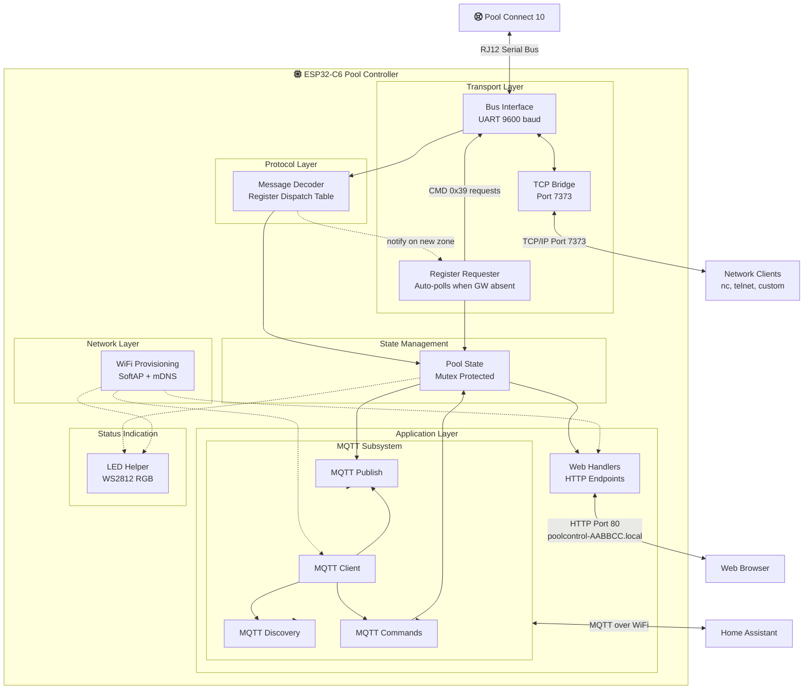

# Pool Controller

Code to listen on and control a Connect 10 pool controller.  I created it as a learning project and happy to collaborate with people who find it useful.
This has been created by listening to the communications on the control bus, and decoding the instructions by trial and error.
It is designed to run on and ESP32-C6, and there is a [circuit and PCB design](https://github.com/marklynch/pool-controller-pcb) documented here.

**Note** this is **not an official product** and is not supported by Fluidra.

## Current Status

Tested as working:
- Lights work fully — state, colour, zone name, multicolor capability ✅
- Pool/Spa mode works ✅
- Temperature set points for pool and spa work ✅
- Heater on/off works ✅
- Channel switching working - toggle On/Auto/Off ✅
- Valves reading and switching working ✅
- Reading of timers ✅
- Reading of ORP/PH settings ✅
- Reading of water temperature ✅
- Reading config for channels, lights and heater ✅
- Reading of config/state for Internet Gateway ✅
- Reading of touchscreen and Internet Gateway firmware versions ✅
- Auto-requests missing timer and light config when Internet Gateway is absent ✅


## Output
To see the output, either monitor the device using the ESP monitor - or connect to the port exposed on the wifi network.

Each device gets a unique mDNS hostname derived from the last 3 bytes of its MAC address:
`poolcontrol-AABBCC.local` — where `AABBCC` matches the suffix of the provisioning AP name (`POOL_AABBCC`).

For example, if you provisioned via the `POOL_A1B2C3` network, the device will be accessible at `poolcontrol-A1B2C3.local`.  The serial number shown on the device's home page uses the same identifier.

Example on a mac using nc (netcat)
```
% nc poolcontrol-A1B2C3.local 7373
Connected to ESP32-C6 pool bus bridge.
UART bytes will be shown here in hex.
Bytes you send will be forwarded to the bus.

00
02 00 50 FF FF 80 00 FD 0F DC 19 0E 01 28 03
00
```

## Testing Message Decoding

You can test individual messages against the decoder using the HTTP API endpoint:

```bash
curl -X POST http://poolcontrol-A1B2C3.local/api/test_decode \
  -d "02 00 50 FF FF 80 00 38 0F 17 D0 01 02 1A 03"
```

**Response:**
```json
{
  "success": true,
  "decoded": true,
  "length": 15,
  "hex": "02 00 50 FF FF 80 00 38 0F 17 D0 01 02 1A 03",
  "message": "Check ESP logs for decode details"
}
```

- `decoded: true` - Pattern matched and message was decoded
- `decoded: false` - Unknown message type

**To see full decode details**, monitor the ESP logs:
```bash
idf.py monitor
```

You'll see output like:
```
I (12345) MSG_DECODER: [Controller -> Broadcast] Lighting zone 1 state - On
```

This allows you to quickly test message patterns and verify decoder behavior without needing to send messages to the actual bus.

## Initial Provisioning

1. When the LED is **purple**, the device is in provisioning mode.
2. On your phone, connect to the WiFi network named **`POOL_AABBCC`** (e.g. `POOL_A1B2C3`) — the `AABBCC` suffix is unique to each device.
3. In your phone's browser navigate to **http://192.168.4.1** and choose your WiFi network and enter the password.
4. The device will save the credentials and restart. The LED will turn white then green once connected.

Once on your network the device is accessible at **`http://poolcontrol-AABBCC.local`** — using the same `AABBCC` suffix as the AP you provisioned through (e.g. `http://poolcontrol-A1B2C3.local`).

**Note:** If the wrong password is entered the device will retry for about 30 seconds then return to provisioning mode.

**Note:** To re-provision, erase the flash ("Erase Flash Memory from device" in your IDE) to clear the saved credentials.

## Visual Feedback (LED Status):

### Persistent States (Solid Colors)
* **Blue** - Startup (brief, during boot)
* **Purple** - Unconfigured (no WiFi credentials, provisioning mode active)
* **White** - WiFi connected, waiting for MQTT connection
* **Green** - Fully operational (WiFi + MQTT connected) ✓
* **Orange** - MQTT disconnected (WiFi ok, MQTT issue)

### Activity Indicators (Brief Flashes)
* **Cyan flash** - RJ12 data received (RX)
* **Magenta flash** - RJ12 data transmitted (TX)

### Boot Flow Examples

**First Boot (No WiFi):**
1. Blue (startup)
2. Purple (unconfigured - connect to AP)
3. Connect to AP → Configure WiFi → Device restarts

**Normal Boot (WiFi Configured):**
1. Blue (startup)
2. White (WiFi connected)
3. Green (MQTT connected) ✓

**MQTT Connection Issue:**
1. Blue (startup)
2. White (WiFi connected)
3. Orange (MQTT failed to connect)


## General architecture



The system consists of an ESP32 C6 module that can be daisy chained into an existing connect 10 system via a RJ12 connection.

It sets up a WiFi AP called `POOL_AABBCC` (where `AABBCC` is the last 3 bytes of the device's MAC address). Connecting to that AP and navigating to `192.168.4.1` opens the provisioning page. Once configured and on your network, the device is accessible at `poolcontrol-AABBCC.local` using the same suffix.

It uses MQTT to connect and publish information and receive information from Home Assistant.

## Building and Flashing

This project uses ESP-IDF v5.5+. See `CLAUDE.md` for build commands and architecture details.

```bash
idf.py build          # Build the project
idf.py flash monitor  # Flash to device and monitor output
```

## Documentation

### [PROTOCOL.md](PROTOCOL.md) — Bus Protocol Reference

Documents the proprietary serial protocol used by the Connect 10, reverse-engineered by sniffing bus traffic. Covers:

- **Message framing** — `START (0x02) | SRC | DST | CTRL | CMD | DATA | CHECKSUM | END (0x03)`
- **Device addresses** — Touch screen (`0x0050`), controller (`0x006F`), chlorinator (`0x0090`), internet gateway (`0x00F0`)
- **30+ decoded message types** — temperatures, channel states, lighting zones (state, colour, name, multicolor capability), chlorinator pH/ORP, controller clock, firmware versions, gateway network status, and more
- **Register system** — A unified register/slot dispatch mechanism used for channel names, types, lighting colors, and labels
- **Control commands** — How to toggle channels, set temperature setpoints, control lighting zones, switch pool/spa mode, and control the heater (all by impersonating the internet gateway address `0x00F0`)
- **Checksum algorithm** and message validation rules

### [OTA_UPDATE.md](OTA_UPDATE.md) — Over-The-Air Firmware Updates

Describes the web-based OTA update system. Covers:

- **How to update** — Build the `.bin`, navigate to `http://<device-ip>/update`, upload via the web form
- **Dual-partition layout** — Updates alternate between `ota_0` and `ota_1`, with automatic rollback if the new firmware fails to boot
- **Safety** — Image validation before write, boot confirmation required by new firmware, rollback after 3 failed boots
- **Version information** — Version string generated from `git describe` (e.g. `v1.0.0-5-g870d65b`)
- **Security notes** — No authentication on `/update` currently; see the doc for recommended production hardening
