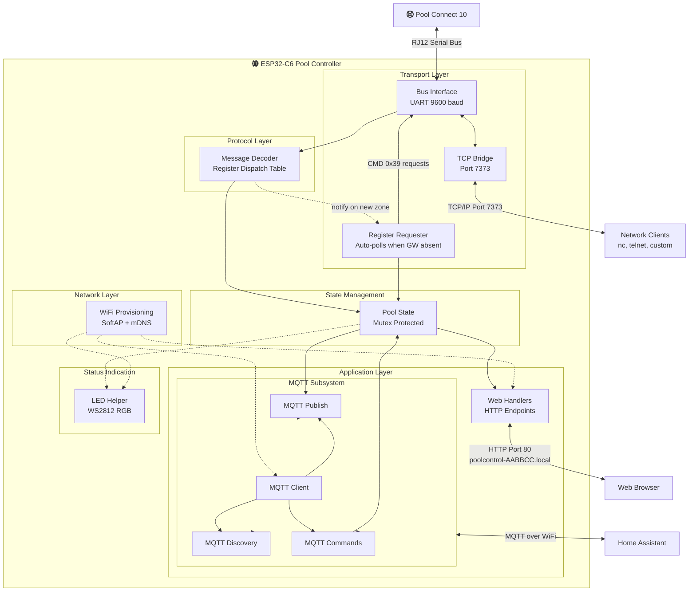

# Pool Controller

  [](https://github.com/marklynch/pool-controller-code/actions/workflows/build.yml
  )
  [](https://github.com/marklynch/pool-controller-code/releases)
  [](LICENSE)
  [](https://github.com/espressif/esp-idf)
  [](https://core-electronics.com.au/esp32-c6-mini-development-board-wifi6-bluetooth5.html)

Code to listen on and control a Connect 10 pool controller.  I created it as a learning project and happy to collaborate with people who find it useful.
This has been created by listening to the communications on the control bus, and decoding the instructions by trial and error.

## Core components
1. [Controller code (this repo)](https://github.com/marklynch/pool-controller-code)
2. [Circuit and PCB design](https://github.com/marklynch/pool-controller-pcb)
3. ESP32-C6 - It's been designed around the [Waveshare ESP32-C6 Mini Development Board ](https://core-electronics.com.au/esp32-c6-mini-development-board-wifi6-bluetooth5.html)
4. [Case for Pool Controller](https://github.com/marklynch/pool-controller-case)

**Note** this is **not an official product** and does not come with support or any warranty.  Note it is NOT connected to or supported by Fluidra.

## Current Status

Tested as working:
- Lights work fully — state, colour, zone name, multicolor capability ✅
- Pool/Spa mode works ✅
- Temperature set points for pool and spa work ✅
- Heater on/off works ✅
- Channel switching working - toggle On/Auto/Off ✅
- Valves reading and switching working ✅
- Reading of timers ✅
- Reading of ORP/PH settings ✅
- Reading of water temperature ✅
- Reading config for channels, lights and heater ✅
- Reading of config/state for Internet Gateway ✅
- Reading of touchscreen and Internet Gateway firmware versions ✅
- Auto-requests missing timer and light config when Internet Gateway is absent ✅


## Getting Started

The device has three connectors:

- **2 × RJ12 sockets** — for the pool control bus. Use a standard flat RJ12 cable to connect either socket to your Connect 10 system; this also powers the device. The two sockets are wired in parallel, so the second one can be used to daisy-chain another device (e.g. another controller, gateway, or accessory) on the same bus.
- **1 × USB-C socket** — for manually flashing firmware and serial monitoring from a computer. It is **not** required for normal operation.

To bring the device online for the first time:

1. Plug a flat RJ12 cable from the Connect 10 into either RJ12 socket on the device. This both connects it to the pool bus and powers it. (Optional: run a second cable from the other RJ12 socket to daisy-chain the next device on the bus.)
2. Wait for the LED to turn **purple**, which indicates the device is in provisioning mode and ready for WiFi setup (see [Initial Wifi Provisioning](#initial-wifi-provisioning) below).

## Initial Wifi Provisioning

1. When the LED is **purple**, the device is in provisioning mode.
2. On your phone, connect to the WiFi network named **`POOL_AABBCC`** (e.g. `POOL_A1B2C3`) — the `AABBCC` suffix is unique to each device. The password is **`poolsetup`**.
3. In your phone's browser navigate to **http://192.168.4.1** and choose your WiFi network and enter the password.
4. The device will save the credentials and restart. The LED will turn white then green once connected.

Once on your network the device is accessible at **`http://poolcontrol-AABBCC.local`** — using the same `AABBCC` suffix as the AP you provisioned through (e.g. `http://poolcontrol-A1B2C3.local`).

**Note:** If the wrong password is entered the device will retry for about 30 seconds then return to provisioning mode.

**Note:** To re-provision, erase the flash ("Erase Flash Memory from device" in your IDE) to clear the saved credentials.

## Visual Feedback (LED Status):

### Persistent States (Solid Colors)
* **Blue** - Startup (brief, during boot)
* **Purple** - Unconfigured (no WiFi credentials, provisioning mode active)
* **White** - WiFi connected, waiting for MQTT connection
* **Green** - Fully operational (WiFi + MQTT connected) ✓
* **Orange** - MQTT disconnected (WiFi ok, MQTT issue)

### Activity Indicators (Brief Flashes)
* **Cyan flash** - RJ12 data received (RX)
* **Magenta flash** - RJ12 data transmitted (TX)

### Boot Flow Examples

**First Boot (No WiFi):**
1. Blue (startup)
2. Purple (unconfigured - connect to AP)
3. Connect to AP → Configure WiFi → Device restarts

**Normal Boot (WiFi Configured):**
1. Blue (startup)
2. White (WiFi connected)
3. Green (MQTT connected) ✓

**MQTT Connection Issue:**
1. Blue (startup)
2. White (WiFi connected)
3. Orange (MQTT failed to connect)


## TCP Debug Connection (Port 7373)

The device exposes a raw TCP server on port 7373 that streams all bus traffic as hex and forwards any bytes you send back onto the bus. It also mirrors the device's log output, so you can monitor activity without a USB cable.

Each device gets a unique mDNS hostname derived from the last 3 bytes of its MAC address:
`poolcontrol-AABBCC.local` — where `AABBCC` matches the suffix of the provisioning AP name (`POOL_AABBCC`).

For example, if you provisioned via the `POOL_A1B2C3` network, the device will be accessible at `poolcontrol-A1B2C3.local`.

### Mac / Linux

Use `nc` (netcat), which is installed by default:

```bash
nc poolcontrol-A1B2C3.local 7373
```

Example session:
```
Connected to pool control bus bridge.
UART bytes will be shown here in hex.
Bytes you send will be forwarded to the bus.

00
02 00 50 FF FF 80 00 FD 0F DC 19 0E 01 28 03
00
```

To send a raw command to the bus, type the bytes as a hex string and press Enter:
```
02 00 F0 00 50 80 00 39 0F 0E E7 01 00 00 03
```

### Windows

**Option 1 — PuTTY (recommended)**

1. Download [PuTTY](https://www.chiark.greenend.org.uk/~sgtatham/putty/latest.html) if you don't have it.
2. Set **Connection type** to **Raw**.
3. Enter `poolcontrol-A1B2C3.local` as the host and `7373` as the port.
4. Click **Open**.

**Option 2 — Telnet**

If the Telnet client is enabled (Control Panel → Programs → Turn Windows features on/off → Telnet Client):

```cmd
telnet poolcontrol-A1B2C3.local 7373
```

**Option 3 — Windows Subsystem for Linux (WSL)**

If WSL is installed, use `nc` exactly as on Mac/Linux:

```bash
nc poolcontrol-A1B2C3.local 7373
```

## Testing Message Decoding

You can test individual messages against the decoder using the HTTP API endpoint:

```bash
curl -X POST http://poolcontrol-A1B2C3.local/api/test_decode \
  -d "02 00 50 FF FF 80 00 38 0F 17 D0 01 02 1A 03"
```

**Response:**
```json
{
  "success": true,
  "decoded": true,
  "length": 15,
  "hex": "02 00 50 FF FF 80 00 38 0F 17 D0 01 02 1A 03",
  "message": "Check ESP logs for decode details"
}
```

- `decoded: true` - Pattern matched and message was decoded
- `decoded: false` - Unknown message type

**To see full decode details**, monitor the ESP logs:
```bash
idf.py monitor
```

You'll see output like:
```
I (12345) MSG_DECODER: [Controller -> Broadcast] Lighting zone 1 state - On
```

This allows you to quickly test message patterns and verify decoder behavior without needing to send messages to the actual bus.

## Message Counters

The device keeps global counters of all bus traffic, shown in the **Messages** row of the home page and in the `/status` JSON:

```json
"message_counts": {
  "decoded": 12345,
  "unknown": 67,
  "errors": 3,
  "error_detail": {
    "no_start_byte": 0,
    "bad_control": 1,
    "no_end": 2,
    "bad_framing": 0,
    "length_mismatch": 0,
    "header_checksum": 0,
    "data_checksum": 0
  }
}
```

- **decoded** — frames matched and handled by the decoder
- **unknown** — well-formed frames the decoder has no handler for
- **errors** — frames or byte stretches broken at the protocol level

The three buckets are exclusive: `decoded + unknown + errors` equals the total traffic seen. A frame with a validation error is still dispatched to the decoder, but counts only as an error.

`error_detail` breaks errors down by type:

| Type | Detected by | Meaning |
|------|-------------|---------|
| `no_start_byte` | frame reassembly | Buffer contained no START byte (`0x02`); all bytes discarded |
| `bad_control` | frame reassembly | START byte found but control bytes weren't `80 00`; resynced by one byte |
| `no_end` | frame reassembly | Buffer filled without a valid data checksum + END (`0x03`) match — an over-long message or a corrupted data checksum (indistinguishable, since the checksum is used to locate the end of frame) |
| `bad_framing` | decoder | Frame shorter than 12 bytes or missing START/END markers |
| `length_mismatch` | decoder | Length field (byte 8) didn't match the actual frame length |
| `header_checksum` | decoder | Header checksum (byte 9) didn't match the sum of bytes 0–8 |
| `data_checksum` | decoder | Data checksum didn't match (defensive — frame reassembly already validates it) |

The frame-reassembly counters count discard *events*, not messages: a single corrupt stretch can increment `bad_control` once per stray `0x02` it contains, and `no_start_byte` counts whole-buffer discards. Treat them as bus-corruption indicators rather than exact message counts.

## Host-based Tests

The decoder can be exercised on the host (no device required) by replaying captured log files through `message_decoder.c`. Each `RX MSG: <hex>` line in a sample is fed into `decode_message()`, and the captured ESP_LOG output is diffed against the `MSG_DECODER:` lines that follow in the file (timestamps ignored). This catches behaviour drift between a captured trace and the current decoder.

### Running

```bash
bash test/run_tests.sh
```

Builds and runs every `test/test_*.c` (except the skip list — see top of `run_tests.sh`), then replays every `*.txt` under `test/samples/`.

From VS Code inside the devcontainer: **Cmd+Shift+P → "Tasks: Run Task"** lists:

- **Run Tests** — full suite (unit + replay).
- **Replay: all samples** — just the replay step.
- **Replay: bless all samples** — rewrite expected output in every sample using the current decoder's output. Use after intentional decoder/logging changes, then review `git diff test/samples/` before committing.
- **Replay: single file** / **Replay: bless single file** — same but prompted for a single path.
- **Framing: run** — exercise the sliding-window frame parser against the goldens in `test/frames/`.
- **Framing: bless goldens** — regenerate `test/frames/*_output.txt` from the current parser. Use after intentional framing changes, then review `git diff test/frames/` before committing.

### Adding a regression sample

1. Capture bus traffic into a log file (e.g. via the TCP debug port or `idf.py monitor`).
2. Drop the file into `test/samples/`.
3. Run **Replay: bless single file** against it — this normalises the expected output to the current decoder.
4. Review with `git diff`, then commit. The file is now a regression test.

### Frame parser (sliding window) tests

The frame parser is tested separately from the decoder: each line of `test/frames/observed_error_frames.txt` (real bus captures) and `test/frames/synthetic_errors.txt` (synthetic, one per failure mode) is fed to the parser, and the ordered stream of resync events (`Resync:  <type>`) and decoded frames is diffed against the matching `--- Case N ---` block in the `*_output.txt` golden. On a mismatch the failure prints the source location as `path:line`.

The goldens are blessable from the CLI, mirroring replay:

```bash
cd test
gcc -I. -I.. -o run_framing test_framing.c log_capture.c && ./run_framing --bless; rm -f run_framing
```

After blessing, review `git diff test/frames/` — the diff is the exact record of how parser behaviour changed.

### Improving "Unhandled" message logging

When the decoder gains support for a previously-unknown command, replaying old samples surfaces it as a mismatch (e.g. `Unhandled CMD=0xXX` → real decode). Bless the affected samples and the diff in git is the exact documentation of what improved.


## General architecture


```mermaid
flowchart TD

    Pool[fa:fa-life-ring Pool Connect 10]

    subgraph ESP32-C6[fa:fa-microchip ESP32-C6 Pool Controller]
        subgraph Transport[Transport Layer]
            Bus[Bus Interface<br/>UART 9600 baud]
            TCP[TCP Bridge<br/>Port 7373]
            RegReq[Register Requester<br/>Auto-polls when GW absent]
        end

        subgraph Protocol[Protocol Layer]
            Decoder[Message Decoder<br/>Register Dispatch Table]
        end

        subgraph State[State Management]
            PoolState[Pool State<br/>Mutex Protected]
        end

        subgraph Network[Network Layer]
            WiFi[WiFi Provisioning<br/>SoftAP + mDNS]
        end

        subgraph Application[Application Layer]
            WebAPI[Web Handlers<br/>HTTP Endpoints]

            subgraph MQTTSub[MQTT Subsystem]
                MQTTClient[MQTT Client]
                MQTTPub[MQTT Publish]
                MQTTDisc[MQTT Discovery]
                MQTTCmd[MQTT Commands]
            end
        end

        subgraph Status[Status Indication]
            LED[LED Helper<br/>WS2812 RGB]
        end

        Bus <--> TCP
        Bus --> Decoder
        Decoder --> PoolState
        Decoder -.->|notify on new zone| RegReq
        RegReq --> PoolState
        RegReq -->|CMD 0x39 requests| Bus
        PoolState --> MQTTPub
        PoolState --> WebAPI
        MQTTCmd --> PoolState
        WiFi -.-> WebAPI
        WiFi -.-> MQTTClient
        MQTTClient --> MQTTPub
        MQTTClient --> MQTTDisc
        MQTTClient --> MQTTCmd
        MQTTPub --> MQTTSub
        MQTTDisc --> MQTTSub
        MQTTCmd --> MQTTSub
        PoolState -.-> LED
        WiFi -.-> LED
    end

    Clients[Network Clients<br/>nc, telnet, custom]
    Browser[Web Browser]
    HA[Home Assistant]

    Pool <-->|RJ12 Serial Bus| Bus
    TCP <-->|TCP/IP Port 7373| Clients
    WebAPI <-->|HTTP Port 80<br/>poolcontrol-AABBCC.local| Browser
    MQTTSub <-->|MQTT over WiFi| HA
```

The system consists of an ESP32 C6 module that can be daisy chained into an existing connect 10 system via a RJ12 connection.

It sets up a WiFi AP called `POOL_AABBCC` (where `AABBCC` is the last 3 bytes of the device's MAC address). Connecting to that AP and navigating to `192.168.4.1` opens the provisioning page. Once configured and on your network, the device is accessible at `poolcontrol-AABBCC.local` using the same suffix.

It uses MQTT to connect and publish information and receive information from Home Assistant.

## Building and Flashing

This project uses ESP-IDF v5.5+. See `CLAUDE.md` for build commands and architecture details.

```bash
idf.py build          # Build the project
idf.py flash monitor  # Flash to device and monitor output
```

If you just want a board running the latest release and don't need a toolchain, use the [browser install page](#browser-install-page) instead.

## Releases

Releases are produced by a GitHub Actions workflow (`.github/workflows/build.yml`) that fires on any tag matching `v*`. To cut a release:

```bash
git tag -a v1.0.0 -m "Release v1.0.0"
git push origin v1.0.0
```

The workflow will:

1. Build the firmware with `PROJECT_VER` set to the tag name (embedded into the binary and visible via the device's `/status` page).
2. Create a draft GitHub Release with auto-generated notes.
3. Attach two assets:
   - `pool-controller-update-v1.0.0.bin` — app-only binary, used by both the `/update` upload flow and the GitHub auto-update (the device downloads this asset by name).
   - `pool-controller-full-v1.0.0.bin` — merged bootloader + partition table + otadata + app, for first-time flashing via `esptool.py --chip esp32c6 write_flash 0x0 pool-controller-full-v1.0.0.bin`.
4. Publish the draft.

The published release appears at `https://github.com/marklynch/pool-controller-code/releases/tag/v1.0.0`.

To re-test the workflow without cutting a real release, run it manually from the Actions tab (Build & Release → Run workflow). Manual runs build the firmware and upload it as a workflow artifact but do not create a GitHub Release.

## Browser Install Page

**https://marklynch.github.io/pool-controller-code/**

A first-time flash without installing ESP-IDF or esptool: the page uses [ESP Web Tools](https://github.com/esphome/esp-web-tools) to write `pool-controller-full-*.bin` over Web Serial straight from the browser. It needs desktop Chrome or Edge — Safari, Firefox and mobile browsers have no Web Serial support. Once flashed, the device updates itself over the air, so this is normally a one-time step.

The page is built and deployed by `.github/workflows/pages.yml`:

1. Copies `site/` (the page source) and the device UI's favicons into the site root.
2. Vendors the pinned `esp-web-tools` browser bundle from npm into `vendor/esp-web-tools/`, so the page has no CDN dependency at runtime and the flashing code that ships is reviewable. The step asserts the bundle is self-contained and includes the ESP32-C6 flasher stub.
3. Downloads `pool-controller-full-*.bin` from the **latest published release** and writes a `manifest.json` pointing at it.

The binary is served from the Pages origin rather than linked to the GitHub release asset, which keeps the browser's fetch same-origin and avoids depending on the release CDN's CORS headers.

The workflow runs when a tag build publishes a release (called as a job from `build.yml`), on pushes to `main` that touch `site/`, and on manual dispatch. It is invoked directly from `build.yml` rather than keyed off the `release: published` event because events raised with `GITHUB_TOKEN` do not start new workflow runs.

**One-time setup:** in the repository's Settings → Pages, set **Source** to **GitHub Actions**. The first deploy needs at least one published release to exist.

## Documentation

### [PROTOCOL.md](PROTOCOL.md) — Bus Protocol Reference

Documents the proprietary serial protocol used by the Connect 10, reverse-engineered by sniffing bus traffic. Covers:

- **Message framing** — `START (0x02) | SRC | DST | CTRL | CMD | DATA | CHECKSUM | END (0x03)`
- **Device addresses** — Touch screen (`0x0050`), controller (`0x006F`), chlorinator (`0x0090`), internet gateway (`0x00F0`)
- **30+ decoded message types** — temperatures, channel states, lighting zones (state, colour, name, multicolor capability), chlorinator pH/ORP, controller clock, firmware versions, gateway network status, and more
- **Register system** — A unified register/slot dispatch mechanism used for channel names, types, lighting colors, and labels
- **Control commands** — How to toggle channels, set temperature setpoints, control lighting zones, switch pool/spa mode, and control the heater (all by impersonating the internet gateway address `0x00F0`)
- **Checksum algorithm** and message validation rules

### [OTA_UPDATE.md](OTA_UPDATE.md) — Over-The-Air Firmware Updates

Describes the OTA update system. Covers:

- **Update from GitHub** — The device checks the GitHub *latest release* on a schedule and can download/install it on demand from the `/update` page or the Home Assistant `update` entity — no local file handling
- **Home Assistant update entity** — A "Firmware" update entity shows installed/latest versions and installs with the HA *Install* button, reporting download progress
- **Manual upload** — Build the `.bin`, navigate to `http://<device-ip>/update`, upload via the web form
- **Dual-partition layout** — Updates alternate between `ota_0` and `ota_1`, with automatic rollback if the new firmware fails to boot
- **Safety** — Image validation before write, boot confirmation required by new firmware, rollback after 3 failed boots
- **Version information** — Version string generated from `git describe` (e.g. `v1.0.0-5-g870d65b`)
- **Security notes** — No authentication on the update endpoints currently; see the doc for recommended production hardening
